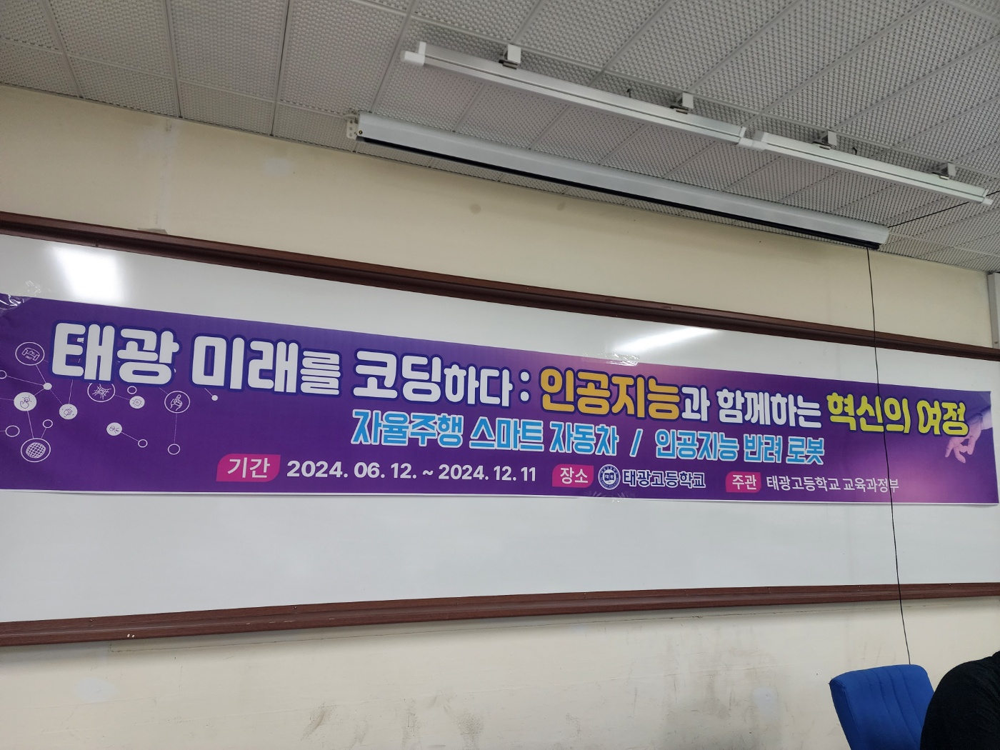

# AI & Robotics Lecture - Taekwang High School (2024)



> 2024년 **태광고등학교 4차산업과수학 동아리**에서 진행된  
> **인공지능과 로봇 실습 강의 시리즈** 자료 모음입니다.

## 강의 목표
- **AI 핵심 개념** 이해: 머신러닝, 딥러닝, 데이터의 의미  
- **로봇 실습 경험**: 아두이노, 센서, 모터, XGO 로봇 제어  
- **4차 산업 기술의 융합적 사고** 체득  
- 이론 → 실습 → 응용으로 이어지는 **체험형 AI 교육**


---

## 📚 커리큘럼 및 자료 구성

| 회차 | 날짜 | 주제 | 주요 내용 | 자료 |
|------|------|------|------------|------|
| 1 | 5.29 | **머신러닝 기초** | 데이터·모델·MSE·경사하강법 | [`5.29_동아리_강의자료(LinearRegression).pptx`](01_LinearRegression/slides/5.29_동아리_강의자료(LinearRegression).pptx) |
| 2 | 6.12 | **딥러닝 개념** | 인공신경망·가중치·활성화함수·역전파 | [`6.12_동아리_강의자료(DeepLearning).pptx`](02_DeepLearning/slides/6.12_동아리_강의자료(DeepLearning).pptx) |
| 3 | 6.12 | **아두이노 입문 ①** | 서보모터·초음파·적외선 센서 원리 | [`6.12_아두이노_강의자료(Arduino).pptx`](03_Arduino_Basic/slides/6.12_아두이노_강의자료(Arduino).pptx) |
| 4 | 7.10 | **아두이노 입문 ②** | 초음파 거리 측정·적외선 감지 실습 | [`7.10_아두이노_강의자료(Arduino).pptx`](03_Arduino_Basic/slides/7.10_아두이노_강의자료(Arduino).pptx) |
| 5 | 8.28 | **정렬 알고리즘 실습** | 선택·버블·삽입 정렬, 순서도 설계 | [`8.28_동아리_강의자료(SortingAlgorithms).pptx`](04_SortingAlgorithms/slides/8.28_동아리_강의자료(SortingAlgorithms).pptx) |
| 6 | 9.10 | **자료구조 & 암호화** | 스택/큐 구조, 카이사르·RSA 암호 원리 | [`9.10_동아리_강의자료(DataStructures_Encryption).pptx`](05_DataStructures_Encryption/slides/9.10_동아리_강의자료(DataStructures_Encryption).pptx) |
| 7 | 10.23 | **아두이노 RC카 제어** | 모터 드라이버, 센서 기반 장애물 회피 | [`10.23_아두이노_강의자료(Arduino_RCcar).pptx`](06_Arduino_RCcar/slides/10.23_아두이노_강의자료(Arduino_RCcar)) |
| 8 | 10.30 | **XGO 로봇 실습** | 블록코딩으로 로봇팔 제어 및 이동 경로 설정 | [`10.30_XGO_강의자료(XGO_Robot).pptx`](07_XGO_Robot/slides/10.30_XGO_강의자료(XGO_Robot).pptx) |

---

## 🗂️ Directory Structure

```text
taekwang-ai-lectures-2024/
├── README.md
│
├── 01_LinearRegression/
│   ├── slides/
│   │   └── 5.29_동아리_강의자료(LinearRegression).pptx
│   └── code/
│       └── 선형회귀_실습자료.ipynb
│
├── 02_DeepLearning/
│   └── slides/
│       └── 6.12_동아리_강의자료(DeepLearning).pptx
│
├── 03_Arduino_Basic/
│   ├── slides/
│   │    ├── 6.12_아두이노_강의자료(Arduino).pptx
│   │    └── 7.10_아두이노_강의자료(Arduino).pptx
│   └── code/
│       ├── 실습1_Servo_motor.ino
│       ├── 실습2_Ultrasonic_sensor.ino
│       ├── 실습3_Line_sensor.ino
│       └── 실습4_IR_remote.ino
│ 
├── 04_SortingAlgorithms/
│   └── slides/
│       └── 8.28_동아리_강의자료(SortingAlgorithms).pptx
│
├── 05_DataStructures_Encryption/
│   └── slides/
│       └── 9.10_동아리_강의자료(DataStructures_Encryption).pptx
│
├── 06_Arduino_RCcar/
│   └── slides/
│   │   └── 10.23_아두이노_강의자료(Arduino_RCcar).pptx
│   └── code/
│       ├── 실습1_RC_Car_keyboard.ino
│       ├── 실습2_RC_CAR_UltraSonic.ino
│       └── 실습3_RC_Car_trace.ino
│
└── 07_XGO_Robot/
    └── slides/
        └── 10.30_XGO_강의자료(XGO_Robot).pptx
```

---

## 🪪 License
본 저장소는 교육 및 참고 목적의 공개 자료이며,  
비상업적 사용 및 2차 활용 시 **출처 표기**를 권장합니다.